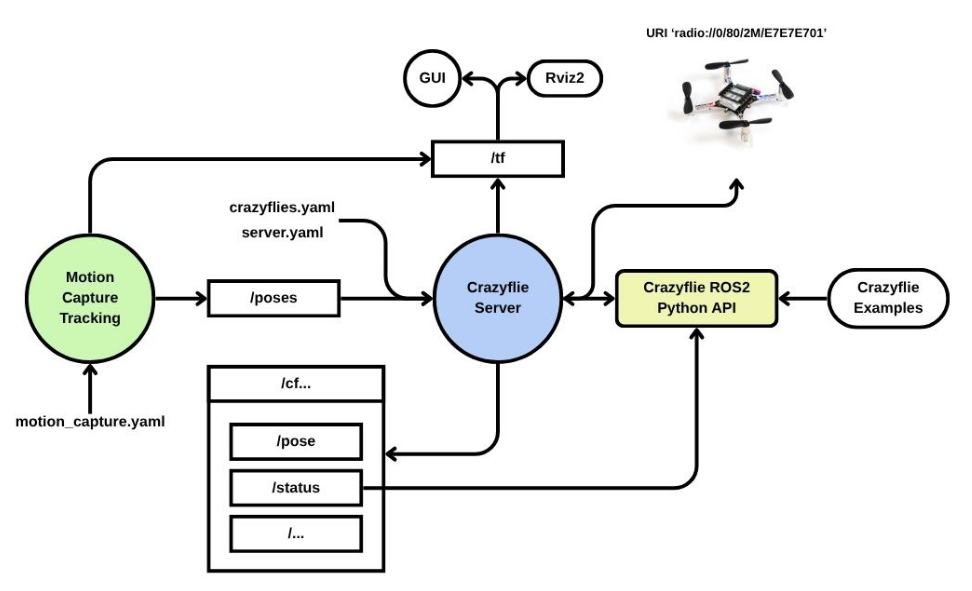

Comandos
========

Crazyswarm2 es un paquete de ROS2, por lo cual, todas las herramientas y comandos se ejecutan por medio de la terminal. A continuación se describen los principales comandos utilizados para ejecutar Crazyswarm2.

Crazyflie Server
----------------

El comando ``ros2 launch crazyflie launch.py backend:=cflib`` inicia el servidor de Crazyswarm2, que es responsable de gestionar la comunicación con los drones Crazyflie. Este comando debe ejecutarse antes de iniciar cualquier rutina de vuelo o comando relacionado con los drones. En este caso se utiliza el backend ``cflib``, que es el backend de python que presento mejores resultados en el proyecto.

